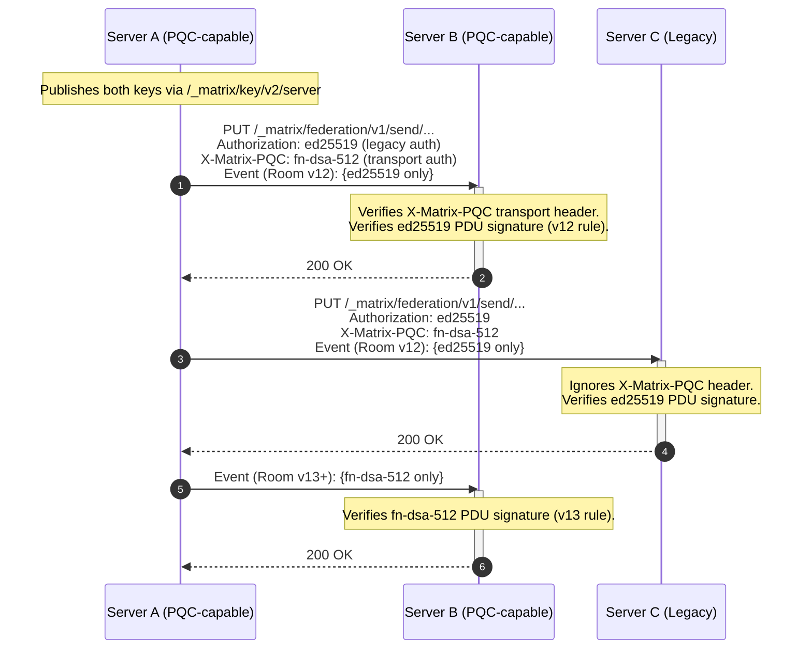

# MSC XXXX: Post-Quantum Digital Signatures for Federation and E2EE

Matrix PDU signing and device E2EE systems currently use `ed25519`. Quantum computers can theoretically reverse engineer private keys via Shor's algorithm, breaking elliptic-curve and RSA schemes.

This spec change therefore aims to PREVENT forging new PDUs, spoofing federation requests, and injecting fabricated events. This MSC begins the migration to PQC-safe signatures.

## Proposal

This MSC introduces **FN-DSA** (Fast-Fourier transform over NTRU-Lattice-Based Digital Signature Algorithm), standardized as [NIST FIPS 206](https://csrc.nist.gov/pubs/fips/206/ipd), as the primary post-quantum signature scheme for Matrix. FN-DSA is based on the Falcon algorithm and was selected by NIST specifically for use cases requiring compact signatures and fast verification — both critical for Matrix's high-throughput federation.

### Algorithm Parameters

This MSC proposes a single, unified signature scheme.

| Parameter Set | NIST Level     | Public Key | Signature  | Verification | Use Case                                   |
| ------------- | -------------- | ---------- | ---------- | ------------ | ------------------------------------------ |
| `fn-dsa-512`  | I (128-bit PQ) | 897 bytes  | ~666 bytes | ~0.1 ms      | Server signing keys, PDUs, and device keys |

Matrix event IDs use SHA-256, providing 128-bit (post-quantum) collision resistance (Grover's algorithm). Deploying signatures beyond NIST Level I (128-bit PQ) offers no practical security benefit, as the hash function then becomes a potential bottleneck.

In PQC-required room versions, servers and clients MUST support `fn-dsa-512`.

### Key Identifier Format

Matrix currently identifies keys using the format . This MSC extends the set of recognized algorithm identifiers, currently in the format `algorithm:key_id` (e.g., `ed25519:abc123`).

| Key Algorithm | Description                  | Key ID Format         |
| ------------- | ---------------------------- | --------------------- |
| `ed25519`     | Existing Ed25519 (unchanged) | `ed25519:<key_id>`    |
| `fn-dsa-512`  | FN-DSA at NIST Level I       | `fn-dsa-512:<key_id>` |

Key IDs MUST be unique within each algorithm namespace on a given server.

### Server Signing Keys

The `GET /_matrix/key/v2/server` response must include both types of public keys. We leverage the schema's support of multiple algorithm prefixes:

```json
{
  "server_name": "example.com",
  "verify_keys": {
    "ed25519:auto": {
      "key": "<unpadded-base64-ed25519-pubkey>"
    },
    "fn-dsa-512:pqc0": {
      "key": "<unpadded-base64-fn-dsa-512-pubkey>"
    }
  },
  "old_verify_keys": {
    "fn-dsa-512:pqc_retired": {
      "key": "<unpadded-base64-fn-dsa-512-pubkey>",
      "expired_ts": 1798761600000
    }
  },
  "valid_until_ts": 1798848000000
}
```

FN-DSA public keys are encoded as unpadded base64, just like existing Ed25519 keys.

Servers should begin publishing FN-DSA keys upon implementing this MSC, even before PQC-capable room versions exist. This allows the federation to pre-distribute public keys.

### PDU Signing

To maintain consistency, this MSC does **not** alter the signing rules for legacy room versions.

Instead, PQC PDU signatures are strictly gated to a new room version.

#### Legacy Room Versions (v12 and before)

In older room versions, servers continue to sign and verify PDUs using Ed25519 only.

#### PQC-Required Room Versions (v13+)

In room versions that require PQC signatures (see [Room Version Requirements](#room-version-requirements)):

- Origin servers MUST sign all outgoing PDUs with `fn-dsa-512`.
- Legacy `ed25519` signatures are expressly PROHIBITED to avoid payload bloat and downgrade ambiguity.
- Receiving servers MUST reject PDUs that lack a valid `fn-dsa-512` signature.

```json
{
  "signatures": {
    "example.com": {
      "fn-dsa-512:pqc0": "<base64-fn-dsa-512-signature>"
    }
  }
}
```

### Federation HTTP Authentication

The `X-Matrix` authorization header currently supports Ed25519 signatures for request authentication. This MSC extends it to support FN-DSA.

When communicating with PQC-capable servers, the sender MUST transmit the PQC signature in a dedicated "secondary header," `X-Matrix-PQC`, while continuing to send the existing Ed25519 `Authorization` header for backwards compatibility. (Below example spaced for visual alignment.)

```http
Authorization: X-Matrix origin="example.com",destination="matrix.org",key="ed25519:auto",   sig="<base64-ed25519-signature>"
X-Matrix-PQC:           origin="example.com",destination="matrix.org",key="fn-dsa-512:pqc0",sig="<base64-fn-dsa-signature>"
```

The FN-DSA signature MUST be computed over the exact same canonical JSON representation of the HTTP request (Method, URI, Destination, and body hash) as standard Ed25519 signatures.

Receiving servers that support this spec MUST attempt to verify the `X-Matrix-PQC` header if present. During the transition, if `X-Matrix-PQC` verification fails, the server SHOULD log a warning but MUST NOT reject the request if the `Authorization` header carries a valid Ed25519 signature. Legacy servers will ignore the `X-Matrix-PQC` header entirely.

Because a single federation transaction (`PUT /_matrix/federation/v1/send/{txnId}`) can carry PDUs for multiple rooms — some legacy, some PQC — HTTP authentication cannot be scoped to a specific room version. The Ed25519 `Authorization` header therefore remains a permanent fixture as long as any legacy room exists on the federation. The `X-Matrix-PQC` header provides PQC transport authentication alongside it.

### Event ID and Content Hash Computation

Event IDs in room versions 3 and later are computed as the reference hash of the event. The reference hash is calculated over a subset of the event fields, **excluding signatures**. Therefore, the introduction of FN-DSA signatures does **not** change event ID computation. Event IDs remain stable across the PQC migration.

Similarly, the content hash (`hashes.sha256`) is computed over the canonical JSON of the event **after** the `signatures` and `unsigned` keys are stripped. Adding FN-DSA signatures to the `signatures` object therefore does **not** alter the content hash.

### E2EE Device Key Migration

#### Device Signing Keys

The `/keys/upload` endpoint is extended to accept FN-DSA device signing keys:

```json
{
  "device_keys": {
    "user_id": "@alice:example.com",
    "device_id": "JLAFKJWSCS",
    "algorithms": ["m.olm.v1.curve25519-aes-sha2", "m.megolm.v1.aes-sha2"],
    "keys": {
      "curve25519:JLAFKJWSCS": "<base64-curve25519-key>",
      "ed25519:JLAFKJWSCS": "<base64-ed25519-key>",
      "fn-dsa-512:JLAFKJWSCS": "<base64-fn-dsa-512-key>"
    },
    "signatures": {
      "@alice:example.com": {
        "ed25519:JLAFKJWSCS": "<base64-ed25519-self-signature>",
        "fn-dsa-512:JLAFKJWSCS": "<base64-fn-dsa-512-self-signature>"
      }
    }
  }
}
```

Clients that support this MSC SHOULD upload FN-DSA device keys alongside Ed25519 keys. The `/keys/query` response includes all keys types.

#### Cross-Signing Keys

Cross-signing master, self-signing, and user-signing keys should also support FN-DSA:

```json
{
  "master_key": {
    "user_id": "@alice:example.com",
    "usage": ["master"],
    "keys": {
      "ed25519:base64+master+key": "<base64-ed25519-master-key>",
      "fn-dsa-512:base64+pqc+master+key": "<base64-fn-dsa-512-master-key>"
    }
  }
}
```

When cross-signing a device key, the signing client SHOULD produce both an Ed25519 and an FN-DSA signature. Verifying clients that support this MSC MUST verify the FN-DSA cross-signature if present, and SHOULD treat it as the authoritative trust anchor.

**E2EE Downgrade Risk:** Because `/keys/query` responses are not protected by room versions, a compromised homeserver could strip a user's FN-DSA keys from the JSON to force a legacy Ed25519 fallback. Robust protection against this attack requires client-side key pinning (TOFU) or cryptographically constrained room membership (MSC3917), both of which introduce significant client-side state management and are outside the scope of this MSC. This MSC focuses on the cryptographic primitives and federation-layer changes; E2EE downgrade protection is deferred to a dedicated follow-up proposal.

#### Key Agreement (Informational)

This MSC does **not** change the key agreement algorithm used by Olm/Megolm sessions (currently Curve25519 via X25519). Migration of key agreement to a post-quantum Key Encapsulation Mechanism (e.g., ML-KEM / FIPS 203) is deferred to a separate MSC, as it requires changes to the Olm/Megolm ratchet protocol and is independent of signature migration.

### Client Implementation Requirements

Clients and homeservers have distinct responsibilities in the PQC migration:

**Key Generation.** Clients that support this MSC MUST generate FN-DSA keypairs locally for:

- Device signing keys (`fn-dsa-512`) — uploaded via `/keys/upload`
- Cross-signing keys (`fn-dsa-512`) — uploaded via `/keys/device_signing/upload`

FN-DSA key generation requires constant-time discrete Gaussian sampling. Client implementations MUST use a side-channel-resistant FN-DSA library (see [Falcon's implementation complexity](#potential-issues)). WASM and mobile environments require particular care, as JIT compilation and garbage collection can introduce timing variability.

**Signing.** Clients MUST sign their own device keys with both their Ed25519 and FN-DSA device signing keys (self-signatures). When cross-signing another device or user, the signing client SHOULD produce both an Ed25519 and an FN-DSA cross-signature. **All FN-DSA signatures MUST be computed over the exact same Matrix Canonical JSON representation of the object as the legacy Ed25519 signatures** (i.e., after stripping the `signatures` and `unsigned` fields).

**Verification.** Clients MUST verify FN-DSA signatures in the E2EE trust chain:

- Device key self-signatures (when evaluating a device's authenticity)
- Cross-signing signatures (master → self-signing → device key chain)

Clients do **not** verify PDU signatures or federation HTTP authentication — these are exclusively homeserver responsibilities.

**What clients do NOT need to do:**

- Verify or inspect the `signatures` object on timeline events (homeserver-only)
- Process `X-Matrix-PQC` headers (server-to-server transport)
- Implement FN-DSA for Olm/Megolm key agreement (deferred to a separate MSC)

### Interaction Sequence

The following diagram illustrates federation interactions under this MSC:



### Migration Timeline

By isolating PDU changes to a new room version, this MSC requires only a streamlined two-phase migration:

**Phase 1 — Transport, E2EE, & Key Distribution (Immediate)**
Servers begin publishing FN-DSA keys via `/_matrix/key/v2/server` and transmitting the `X-Matrix-PQC` header for Server-to-Server HTTP authentication. Clients begin uploading `fn-dsa-512` device and cross-signing keys. PDUs continue to be signed exclusively with Ed25519 according to legacy room versions.

**Phase 2 — PQC Room Version (Deployment)**
A new room version is formalized which makes `fn-dsa-512` the sole, authoritative PDU signature scheme. Users and administrators may upgrade existing rooms to this version to gain post-quantum PDU signatures. Legacy rooms (≤v12) remain untouched.

## Room Version Requirements

This MSC requires a **new room version**. All PQC behavioral changes are scoped exclusively to this room version — no changes are introduced to existing room versions. The new room version makes the following changes:

- **PDU signing:** `fn-dsa-512` signature REQUIRED. Legacy `ed25519` signatures are strictly FORBIDDEN to prevent heterogeneous event formats.
- **Signature verification in auth rules:** Step 5 of the [checks performed on receipt of a PDU](https://spec.matrix.org/v1.14/server-server-api/#checks-performed-on-receipt-of-a-pdu) ("Passes signature checks...") is modified to require verification of the FN-DSA signature. **However, for historical events received via backfill, this step is bypassed if the event's SHA-256 reference hash (Event ID) securely matches the `prev_events` hash of an already-verified forward event in the DAG.** If no FN-DSA signature is present and the event is not anchored by a known valid hash, the event is rejected.
- **Redaction algorithm:** The `signatures` field behavior is unchanged — redacted events retain all signatures, including FN-DSA signatures.
- **Event format:** No changes to event format. FN-DSA signatures are entries in the existing `signatures` object.
- **Signature Condensation (Optional):** To mitigate the storage cost of the PQC signature, servers MAY perform **Signature Condensation**. Because downstream workflows like ZK proofs (MSCYYYY) only require the signature to compute a cryptographic commitment (`h_auth = Keccak-256(event_id || signature)`), a server can compute and store this 32-byte hash in place of the full FN-DSA signature, securely discarding the ~888-byte Base64 string from disk while preserving mathematical provability.

The new room version does **not** change:

- State resolution algorithm (remains v2)
- Event ID computation (reference hash is signature-independent)
- Auth rules (beyond the signature verification step)
- Redaction rules (beyond signature preservation)

## Potential Issues

- **Signature size increase & protocol limits.** FN-DSA-512 signatures are ~666 bytes vs Ed25519's 64 bytes — a 10× increase per signature. For events co-signed by multiple servers (e.g., during room joins), this increases event payload size. However, the Matrix specification limits PDUs to a maximum of 65,536 bytes (65 KB). Even a heavily authenticated event carrying 10 distinct server signatures would only dedicate ~8.8 KB (Base64 encoded) to signatures, remaining safely below the protocol limit. Furthermore, this MSC introduces **Signature Condensation** (see Performance Opportunities) to eventually compress these signatures down to 32 bytes on disk.

- **FIPS 206 not yet finalized.** As of May 2026, NIST FIPS 206 (FN-DSA) is in the final stages of standardization but has not been published. This MSC uses unstable prefixes during the pre-finalization period. If FIPS 206 is substantively changed before publication, the unstable prefix allows the algorithm parameters to be updated without breaking stable identifiers. The three other NIST PQC standards (FIPS 203/204/205) were finalized in August 2024, and FIPS 206 is expected to follow the same trajectory.

- **Falcon's implementation complexity.** FN-DSA key generation requires sampling from a discrete Gaussian distribution, which is notoriously difficult to implement in constant time. A non-constant-time implementation leaks secret key material via timing side channels. Server implementers MUST use a constant-time FN-DSA implementation. The [reference implementation](https://falcon-sign.info/) and several audited libraries (e.g., `pqcrypto-falcon` in Rust, `liboqs` in C) provide constant-time implementations. Client-side (WASM/mobile) implementations must be similarly hardened.

- **Key rotation complexity.** Servers must now manage and rotate two independent key types. However, Matrix already supports key rotation via `old_verify_keys`, and the mechanics are identical for FN-DSA keys.

- **Public key size impact on key server responses.** An FN-DSA-512 public key is 897 bytes (vs 32 bytes for Ed25519), increasing `/_matrix/key/v2/server` response size by ~1.2 KB per active key. This is negligible for modern networks.

## Alternatives

- **ML-DSA (FIPS 204 / Dilithium) instead of FN-DSA.** In theory, ML-DSA could stand as a drop-in replacement. Its algorithm relies exclusively on integer arithmetic, which eliminates the side-channel introspection attacks that FN-DSA's floating-point Gaussian sampling is theoretically (although seldom practically) vulnerable to. The downside to ML-DSA is its massive bandwidth footprint. FN-DSA signatures stay in the 600–900 byte range, whereas ML-DSA-44 exceeds 2.4 KB. Because Matrix events are federally replicated and heavily co-signed, the ML-DSA payload bloat is prohibitive. ML-DSA could serve as a fallback if FN-DSA standardization is delayed, but FN-DSA remains the vastly superior choice for high-throughput environments.

- **SLH-DSA (FIPS 205 / SPHINCS+) instead of FN-DSA.** SLH-DSA is hash-based and requires no lattice assumptions, making it the most conservative choice cryptographically. However, SLH-DSA-SHA2-128f signatures are 17,088 bytes — entirely impractical for per-event signing. SLH-DSA may be appropriate for long-lived trust anchors (e.g., cross-signing master keys) in a future MSC.

- **Hybrid Ed25519 + ML-KEM instead of algorithm replacement.** Some proposals (e.g., NIST SP 800-227) recommend hybrid classical+PQC constructions where both must be broken to compromise security. This MSC deliberately avoids hybrid PDU signing: in v13+ rooms, FN-DSA is the sole authority, providing a clean break rather than permanent dual-signature overhead. The transport layer (`X-Matrix-PQC` alongside Ed25519 `Authorization`) does use a hybrid approach during transition, but this is limited to HTTP authentication and does not affect event payloads.

- **Waiting for FIPS 206 finalization.** Delaying PQC migration until FIPS 206 is published risks extending the window during which servers are vulnerable to quantum key derivation and real-time impersonation. The unstable prefix mechanism allows early adoption without committing to final identifiers. Servers can begin PQC key distribution immediately with zero risk.

- **Extending Olm/Megolm to PQC in this MSC.** Key agreement (Curve25519 → ML-KEM) and the Olm ratchet protocol are orthogonal to signature migration and significantly more complex. Bundling them would delay the entire MSC. Signature migration can proceed independently and provides immediate protection against server impersonation, while key agreement migration protects message confidentiality (the actual HNDL concern) and is addressed separately.

## Performance & Lightweighting Opportunities

Transitioning to Post-Quantum Cryptography inherently introduces larger key and signature sizes. However, because this MSC requires a new room version, it provides a rare architectural window to introduce optimizations that can actually make Matrix **lighter, faster, and cheaper to host** than its current baseline:

### CPU Optimization: Lattice Verification Speed

It is a common misconception that PQC is universally slower. FN-DSA uses Fast-Fourier Transforms (FFT) over lattices, making its signature verification mathematically faster than Ed25519's elliptic-curve scalar multiplication. For homeservers processing thousands of federated events per second, this migration will result in a measurable reduction in CPU utilization.

### Storage Optimization: Signature Condensation

Matrix currently stores the `signatures` object for every event indefinitely, contributing to database bloat. Because SHA-256 is already quantum-resistant, once an event is buried deep in the DAG (e.g., referenced by hundreds of subsequent events), its cryptographic integrity is permanently locked by the hash chain.

In PQC room versions, servers MAY perform **Signature Condensation** on the FN-DSA signature: because the ZK proof framework (MSCYYYY) only requires the cryptographic commitment `h_auth = Keccak-256(event_id || signature)`, a server can pre-compute and store this 32-byte hash locally, then safely discard the full ~888-byte Base64 FN-DSA signature string from disk. This achieves a ~27× compression ratio on the PQC signature while preserving all mathematical provability for downstream workflows and historical integrity.

### Payload Optimization: Binary Encodings (Informational)

Matrix currently encodes all cryptographic material as Base64 within JSON, mathematically inflating payload sizes by 33%. For Ed25519, this wastes 22 bytes per signature; for FN-DSA, it wastes over 220 bytes. While outside the strict scope of this MSC, the PQC room version provides the ideal catalyst to adopt a binary encoding format like CBOR (e.g., MSC2432) to natively support byte arrays and reclaim this bandwidth.

### HTTP Overhead: Symmetric Federation Auth (Informational)

Attaching an ~888-byte `X-Matrix-PQC` header to every single HTTP request (including tiny payloads like typing notifications or read receipts) is inefficient. This MSC recommends a fast-follow proposal to upgrade federation authentication: servers could use a PQC Key Encapsulation Mechanism (e.g., ML-KEM / FIPS 203) to negotiate a shared symmetric session key between homeservers, replacing per-request asymmetric signatures with a highly compact 32-byte HMAC.

## Implementation Guidance

FN-DSA is not yet as widely deployed as Ed25519, but mature, audited implementations exist across the languages relevant to the Matrix ecosystem:

| Library                                                                                       | Language        | FFI Required                                        | Notes                                                                                                                                                            |
| --------------------------------------------------------------------------------------------- | --------------- | --------------------------------------------------- | ---------------------------------------------------------------------------------------------------------------------------------------------------------------- |
| [liboqs](https://github.com/open-quantum-safe/liboqs)                                         | C               | Yes (FFI bindings for Python, Rust, Go, Java, .NET) | Reference PQC library from the Open Quantum Safe project. Includes Falcon alongside all NIST PQC finalists. Compiles to WASM via Emscripten for browser targets. |
| [oqs-rs](https://github.com/AldanTan);[liboqs-rust](https://github.com/AldanTanneo/liboqs-rs) | Rust (FFI to C) | Yes (wraps liboqs)                                  | Rust bindings for liboqs. Suitable for server-side implementations (e.g., conduwuit, Synapse-via-PyO3).                                                          |
| [pqcrypto-falcon](https://crates.io/crates/pqcrypto-falcon)                                   | Rust            | No (pure Rust)                                      | Part of the `pqcrypto` crate family. No C dependency — simplifies cross-compilation and auditing.                                                                |
| [oqs-provider](https://github.com/open-quantum-safe/oqs-provider)                             | C (OpenSSL 3.x) | N/A                                                 | OpenSSL provider enabling PQC via existing TLS stacks. Useful for federation TLS termination but not directly for Matrix JSON signing.                           |
| [falcon.js](https://github.com/nickthecook/falcon-js) (community)                             | JavaScript      | No                                                  | Community WASM/JS port. Must be audited for constant-time guarantees before production use.                                                                      |

**Constant-time requirement:** All implementations MUST use constant-time discrete Gaussian sampling during key generation and signing. Non-constant-time implementations leak the secret key via timing side channels. The [Falcon reference implementation](https://falcon-sign.info/) provides a constant-time sampler as the default. Implementers SHOULD prefer liboqs or pqcrypto-falcon, which inherit this property.

**WASM and mobile:** liboqs compiles to WebAssembly via Emscripten, enabling browser-based Matrix clients (Element Web, Cinny) to perform FN-DSA operations. Mobile clients (iOS/Android) can use liboqs via platform-native FFI (Swift C interop, JNI). Implementers must verify that the WASM build does not introduce timing variability through JIT compilation or garbage collection.

## Security Considerations

- **Real-time server impersonation.** The primary quantum threat to Matrix signatures is not harvest-now-decrypt-later (which applies to confidentiality, not authentication) but real-time server impersonation. An adversary with a quantum computer can derive any server's Ed25519 private key from its published public key and then forge new PDUs, spoof federation requests, and inject events into live rooms. Matrix's SHA-256 hash-linked DAG protects historical event integrity (SHA-256 is quantum-resistant), but cannot prevent forged _new_ events from being accepted by the federation. This MSC eliminates that attack vector by migrating to quantum-resistant signatures.

- **Quantum threat timeline.** NIST and NSA guidance recommend beginning PQC migration immediately, regardless of when fault-tolerant quantum computers arrive. The U.S. government mandates PQC migration for federal systems by 2035 (CNSA 2.0). Matrix's decentralized architecture means migration requires ecosystem-wide coordination, making early action essential.

- **Side-channel attacks on Falcon.** FN-DSA's discrete Gaussian sampler is the primary side-channel risk. A non-constant-time implementation can leak the secret key through timing, cache, or power analysis. Server implementations MUST use constant-time Gaussian sampling. The NIST FIPS 206 standard mandates constant-time implementation. Matrix client SDKs (especially WASM builds) must audit their FN-DSA implementation for timing leaks.

- **Algorithm agility.** This MSC introduces a general mechanism for adding new signature algorithms (`algorithm:key_id` format) that can accommodate future PQC standards without further MSCs. If FN-DSA is found to be vulnerable before deployment reaches critical mass, the unstable prefix can be deprecated and a replacement algorithm introduced using the same framework.

- **Downgrade attacks (federation).** Because PDU signatures are strictly bound to room versions, a network-level adversary cannot strip FN-DSA signatures from events in a PQC room without invalidating the events entirely. For Server-to-Server HTTP auth, an adversary could strip the `X-Matrix-PQC` header to force legacy Ed25519 verification, but this only compromises transport authentication, not the cryptographic integrity of the underlying PDUs or the DAG.

- **Downgrade attacks (E2EE).** A compromised homeserver could strip FN-DSA keys from `/keys/query` responses, forcing clients to fall back to Ed25519-only cross-signing verification. This MSC does not solve this problem — robust E2EE downgrade protection requires client-side key continuity (TOFU) or cryptographically constrained room membership (MSC3917), which are deferred to a follow-up proposal. In the interim, clients that have previously observed an FN-DSA key for a user SHOULD warn if it disappears.

- **Key compromise recovery.** If a server's FN-DSA private key is compromised, the recovery procedure is identical to Ed25519 key compromise: rotate the key, publish the old key in `old_verify_keys` with an `expired_ts`, and re-sign the `/_matrix/key/v2/server` response. Events signed with the compromised key cannot be retroactively invalidated, consistent with existing Matrix security assumptions.

- **Alignment with ZK proof framework.** The ZK prover framework (MSCYYYY) computes `h_auth` as a Keccak-256 hash over concatenated `(event_id || signature)` pairs. When FN-DSA signatures are used, `h_auth` binds PQC signatures to the proven state. The prover's split-verification architecture (signatures verified natively, DAG proven in-circuit) is unchanged — FN-DSA verification is performed by the native host OS, identical to Ed25519, and the result is committed to the STARK via `h_auth`.

## Unstable Prefix

While this MSC is in development, the following unstable prefixes are used:

| Stable Identifier            | Unstable Identifier                              |
| ---------------------------- | ------------------------------------------------ |
| `fn-dsa-512` (key algorithm) | `org.matrix.mscXXXX.fn-dsa-512`                  |
| `X-Matrix-PQC` (HTTP header) | `X-Matrix-PQC` (no prefix needed, custom header) |

The unstable prefixes are used in `verify_keys` key IDs, `signatures` entries, and `X-Matrix-PQC` header `key` parameters. For example:

```json
{
  "verify_keys": {
    "org.matrix.mscXXXX.fn-dsa-512:pqc0": {
      "key": "<base64-fn-dsa-512-pubkey>"
    }
  }
}
```

Once this MSC is accepted but not yet merged into a released spec version, implementations SHOULD support both the unstable prefix and the stable identifier, accepting either.

## Dependencies

- **NIST FIPS 206 (FN-DSA):** This MSC depends on the finalization of FIPS 206. The unstable prefix period provides a buffer for FIPS 206 to be published. If FIPS 206 is substantively modified, the unstable algorithm parameters will be updated accordingly.
- **MSCYYYY (ZK-Proven Room Joins):** Not a hard dependency, but this MSC is designed to be forward-compatible with MSCYYYY. The `h_auth` computation in MSCYYYY naturally accommodates FN-DSA signatures without modification.

## Backwards Compatibility

This proposal is fully backwards-compatible:

- **Phase 1 (Key Distribution & Transport)** has zero behavioral impact on events. FN-DSA keys in `verify_keys` and the `X-Matrix-PQC` header are safely ignored by servers that don't recognize the algorithm.
- **Phase 2 (PQC Room Versions)** safely isolates all PDU format changes to a new room version. Rooms that are not upgraded continue to use Ed25519 indefinitely. There is no forced migration.
- **No changes to existing endpoints.** All existing federation and client-server API endpoints continue to function identically. The changes are purely additive — new key types, new signature entries, and a new room version.
- **E2EE backwards compatibility.** Clients that do not support FN-DSA device keys will not upload them. The `/keys/query` response includes all uploaded key types, but clients that do not recognize FN-DSA algorithm prefixes will simply ignore those entries. Cross-signing continues to work with Ed25519 keys. FN-DSA cross-signatures are additive.

---

## MSC Checklist

- [ ] Are [appropriate implementation(s)](https://spec.matrix.org/proposals/#implementing-a-proposal) specified in the MSC's PR description?
- [ ] Are all MSCs that this MSC depends on already accepted?
- [x] For each endpoint that is introduced or modified:
  - [x] Have authentication requirements been specified?
  - [x] Have rate-limiting requirements been specified?
  - [x] Have guest access requirements been specified?
  - [x] Are error responses specified?
    - [x] Does each error case have a specified `errcode` (e.g. `M_FORBIDDEN`) and HTTP status code?
      - [ ] If a new `errcode` is introduced, is it clear that it is new?
  - [x] Are the [endpoint conventions](https://spec.matrix.org/latest/appendices/#conventions-for-matrix-apis) honoured?
    - [x] Do HTTP endpoints `use_underscores_like_this`?
    - [x] Will the endpoint return unbounded data? If so, has pagination been considered?
    - [ ] If the endpoint utilises pagination, is it consistent with [the appendices](https://spec.matrix.org/latest/appendices/#pagination)?
- [x] Will the MSC require a new room version, and if so, has that been made clear?
  - [x] Is the reason for a new room version clearly stated? For example, modifying the set of redacted fields changes how event IDs are calculated, thus requiring a new room version.
- [x] Are backwards-compatibility concerns appropriately addressed?
- [x] An introduction exists and clearly outlines the problem being solved. Ideally, the first paragraph should be understandable by a non-technical audience.
- [ ] All outstanding threads are resolved
  - [ ] All feedback is incorporated into the proposal text itself, either as a fix or noted as an alternative
- [x] There is a dedicated "Security Considerations" section which detail any possible attacks/vulnerabilities this proposal may introduce, even if this is "None.". See [RFC3552](https://datatracker.ietf.org/doc/html/rfc3552) for things to think about, but in particular pay attention to the [OWASP Top Ten](https://owasp.org/www-project-top-ten/).
- [x] The other section headings in the template are optional, but even if they are omitted, the relevant details should still be considered somewhere in the text of the proposal. Those section headings are:
  - [x] Introduction
  - [x] Proposal text
  - [x] Potential issues
  - [x] Alternatives
  - [x] Unstable prefix
  - [x] Dependencies
- [x] Stable identifiers are used throughout the proposal, except for the unstable prefix section
  - [x] Unstable prefixes [consider](https://github.com/matrix-org/matrix-spec-proposals/blob/main/README.md#unstable-prefixes) the awkward accepted-but-not-merged state
  - [x] Chosen unstable prefixes do not pollute any global namespace (use "org.matrix.mscXXXX", not "org.matrix").
- [ ] Changes have applicable [Sign Off](https://github.com/matrix-org/matrix-spec-proposals/blob/main/CONTRIBUTING.md#sign-off) from all authors/editors/contributors
