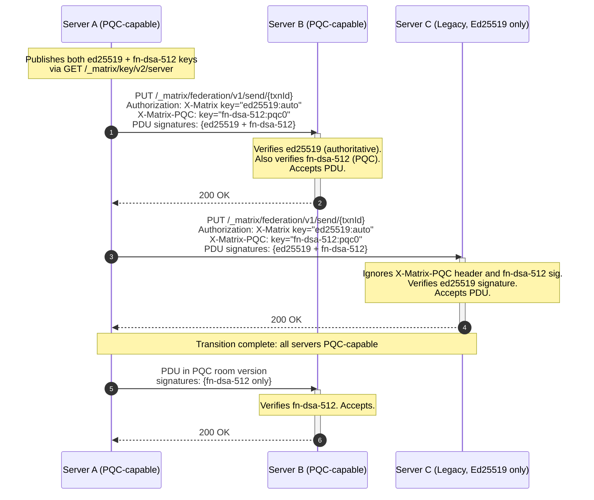

# MSC XXXX: Post-Quantum Digital Signatures for Federation and E2EE

Matrix's federation protocol and end-to-end encryption (E2EE) system rely exclusively on Ed25519 digital signatures. Quantum computers running Shor's algorithm can efficiently derive Ed25519 private keys from their corresponding public keys — and indeed break all elliptic-curve and RSA schemes — reducing their security to zero. Since Matrix server signing keys are fully public (published via `GET /_matrix/key/v2/server`), a quantum-capable adversary would be able to impersonate any homeserver in real time: forging new PDUs, spoofing federation requests, and injecting fabricated events into live room DAGs. While large-scale quantum computers do not yet exist, the timeline for their arrival is uncertain, and Matrix's decentralized architecture requires ecosystem-wide coordination to migrate. This MSC begins that migration now by introducing post-quantum cryptographic (PQC) signature algorithms before the threat window opens.

Note: while historical events cannot be retroactively altered (Matrix's SHA-256 hash-linked DAG ensures integrity regardless of signature scheme), an adversary who derives a server's private key can forge _new_ events that appear authentic to all federation participants. This is the primary threat this MSC addresses.

## Proposal

This MSC introduces **FN-DSA** (Fast-Fourier transform over NTRU-Lattice-Based Digital Signature Algorithm), standardized as [NIST FIPS 206](https://csrc.nist.gov/pubs/fips/206/ipd), as the primary post-quantum signature scheme for Matrix. FN-DSA is based on the Falcon algorithm and was selected by NIST specifically for use cases requiring compact signatures and fast verification — both critical for Matrix's high-throughput federation.

### Algorithm Parameters

This MSC defines two security levels:

| Parameter Set | NIST Level     | Public Key  | Signature    | Verification | Use Case                                         |
| ------------- | -------------- | ----------- | ------------ | ------------ | ------------------------------------------------ |
| `fn-dsa-512`  | I (128-bit PQ) | 897 bytes   | ~666 bytes   | ~0.1 ms      | Server signing keys, PDU signatures, device keys |
| `fn-dsa-1024` | V (256-bit PQ) | 1,793 bytes | ~1,280 bytes | ~0.2 ms      | Cross-signing keys, long-lived trust anchors     |

Servers MUST support `fn-dsa-512`. Servers MAY additionally support `fn-dsa-1024` for higher-security deployments.

### Key Identifier Format

Matrix currently identifies keys using the format `algorithm:key_id` (e.g., `ed25519:abc123`). This MSC extends the set of recognized algorithm identifiers:

| Key Algorithm | Description                  | Key ID Format          |
| ------------- | ---------------------------- | ---------------------- |
| `ed25519`     | Existing Ed25519 (unchanged) | `ed25519:<key_id>`     |
| `fn-dsa-512`  | FN-DSA at NIST Level I       | `fn-dsa-512:<key_id>`  |
| `fn-dsa-1024` | FN-DSA at NIST Level V       | `fn-dsa-1024:<key_id>` |

Key IDs MUST be unique within each algorithm namespace on a given server.

### Server Signing Keys

The `GET /_matrix/key/v2/server` response is extended to include FN-DSA public keys alongside Ed25519 keys. The `verify_keys` and `old_verify_keys` objects already support multiple algorithm prefixes, so no structural changes are needed:

```json
{
  "server_name": "example.com",
  "verify_keys": {
    "ed25519:auto": {
      "key": "<unpadded-base64-ed25519-pubkey>"
    },
    "fn-dsa-512:pqc0": {
      "key": "<unpadded-base64-fn-dsa-512-pubkey>"
    }
  },
  "old_verify_keys": {
    "fn-dsa-512:pqc_retired": {
      "key": "<unpadded-base64-fn-dsa-512-pubkey>",
      "expired_ts": 1798761600000
    }
  },
  "valid_until_ts": 1798848000000
}
```

FN-DSA public keys are encoded as unpadded base64, consistent with existing Ed25519 key encoding. The `key` field for `fn-dsa-512` contains the 897-byte public key (1,196 characters in base64). For `fn-dsa-1024`, the `key` field contains the 1,793-byte public key.

Servers SHOULD begin publishing FN-DSA keys immediately upon implementing this MSC, even before PQC-capable room versions exist. This allows the federation to pre-distribute PQC public keys during the transition period.

### PDU Signing

#### Hybrid Signing (Transition Period)

During the transition period, servers MUST sign outgoing PDUs with **both** their Ed25519 key and their FN-DSA key. The `signatures` object in the event naturally supports this:

```json
{
  "signatures": {
    "example.com": {
      "ed25519:auto": "<base64-ed25519-signature>",
      "fn-dsa-512:pqc0": "<base64-fn-dsa-512-signature>"
    }
  }
}
```

Receiving servers that support this MSC MUST attempt to verify the FN-DSA signature if present. However, the consequence of verification failure depends on the room version — see [Signature Verification Order](#signature-verification-order) for details. Receiving servers that do not support this MSC will ignore the `fn-dsa-512:*` signature entry (as required by the existing spec: "Servers should ignore keys they do not understand").

#### PQC-Required Room Versions

In room versions that require PQC signatures (see [Room Version Requirements](#room-version-requirements)):

- All PDUs MUST carry an `fn-dsa-512` signature from the originating server. Servers MAY additionally include an `fn-dsa-1024` signature, but it does not substitute for the `fn-dsa-512` signature.
- Ed25519 signatures are OPTIONAL and MAY be included for backwards compatibility during the transition, but MUST NOT be the sole signature.
- Receiving servers MUST reject PDUs that lack a valid `fn-dsa-512` signature.

#### Signature Verification Order

To prevent consensus divergence between PQC-capable and legacy servers, signature verification MUST follow these rules:

1. If the room version requires PQC (Phase 3): verify the `fn-dsa-512` signature. If invalid or absent, reject the event. If an `fn-dsa-1024` signature is also present, verify it as well — reject if invalid. Ed25519 verification is OPTIONAL.
2. If the room version does not require PQC (Phase 2 hybrid): verify the Ed25519 signature first. If invalid, reject the event (consistent with legacy server behavior). Then, if an FN-DSA signature is present, verify it as well. If the FN-DSA signature is invalid, the server SHOULD log a warning but MUST NOT reject the event solely on that basis, as the Ed25519 signature remains authoritative in legacy room versions.
3. If no FN-DSA signature is present and the room version does not require PQC, verify Ed25519 only (existing behavior).

This ordering ensures that all servers — PQC-capable and legacy alike — reach the same accept/reject decision for every event during the transition period, preventing DAG divergence.

### Federation HTTP Authentication

The `X-Matrix` authorization header currently supports Ed25519 signatures for request authentication. This MSC extends it to support FN-DSA.

RFC 9110 (HTTP Semantics) prohibits sending multiple `Authorization` headers in a single request, and many reverse proxies (Nginx, Envoy, HAProxy) will drop or corrupt duplicate headers. Therefore, during the transition period, servers MUST transmit the PQC signature in a **dedicated secondary header** `X-Matrix-PQC`, while continuing to send the existing Ed25519 `Authorization` header for backwards compatibility:

```http
Authorization: X-Matrix origin="example.com",destination="matrix.org",key="ed25519:auto",sig="<base64-ed25519-signature>"
X-Matrix-PQC: origin="example.com",destination="matrix.org",key="fn-dsa-512:pqc0",sig="<base64-fn-dsa-signature>"
```

Receiving servers that support this MSC MUST attempt to verify the `X-Matrix-PQC` header if present, in addition to the standard `Authorization` header. During the hybrid transition (Phase 2), if `X-Matrix-PQC` verification fails, the server SHOULD log a warning but MUST NOT reject the request if the `Authorization` header carries a valid Ed25519 signature. In PQC-required contexts (Phase 3), a missing or invalid PQC signature is grounds for rejection. Legacy servers will ignore the `X-Matrix-PQC` header entirely.

In PQC-required contexts (Phase 3), servers MAY send the FN-DSA signature directly in the `Authorization` header using the `X-Matrix` scheme, replacing Ed25519:

```http
Authorization: X-Matrix origin="example.com",destination="matrix.org",key="fn-dsa-512:pqc0",sig="<base64-fn-dsa-signature>"
```

### Event ID and Content Hash Computation

Event IDs in room versions ≥3 are computed as the reference hash of the event. The reference hash is calculated over a subset of the event fields, **excluding signatures**. Therefore, the introduction of FN-DSA signatures does **not** change event ID computation. Event IDs remain stable across the PQC migration.

Similarly, the content hash (`hashes.sha256`) is computed over the canonical JSON of the event **after** the `signatures` and `unsigned` keys are stripped. Adding FN-DSA signatures to the `signatures` object therefore does **not** alter the content hash. Both event IDs and content hashes are fully stable across the PQC migration — no changes to hashing behavior are introduced by this MSC.

### E2EE Device Key Migration

#### Device Signing Keys

The `/keys/upload` endpoint is extended to accept FN-DSA device signing keys:

```json
{
  "device_keys": {
    "user_id": "@alice:example.com",
    "device_id": "JLAFKJWSCS",
    "algorithms": ["m.olm.v1.curve25519-aes-sha2", "m.megolm.v1.aes-sha2"],
    "keys": {
      "curve25519:JLAFKJWSCS": "<base64-curve25519-key>",
      "ed25519:JLAFKJWSCS": "<base64-ed25519-key>",
      "fn-dsa-512:JLAFKJWSCS": "<base64-fn-dsa-512-key>"
    },
    "signatures": {
      "@alice:example.com": {
        "ed25519:JLAFKJWSCS": "<base64-ed25519-self-signature>",
        "fn-dsa-512:JLAFKJWSCS": "<base64-fn-dsa-512-self-signature>"
      }
    }
  }
}
```

Clients that support this MSC SHOULD upload FN-DSA device keys alongside their existing Ed25519 keys. The `/keys/query` response includes all uploaded key types.

#### Cross-Signing Keys

Cross-signing master, self-signing, and user-signing keys are extended to support FN-DSA:

```json
{
  "master_key": {
    "user_id": "@alice:example.com",
    "usage": ["master"],
    "keys": {
      "ed25519:base64+master+key": "<base64-ed25519-master-key>",
      "fn-dsa-1024:base64+pqc+master+key": "<base64-fn-dsa-1024-master-key>"
    }
  }
}
```

Cross-signing keys SHOULD use `fn-dsa-1024` for stronger long-term security, as these keys are trust anchors that persist across device rotations.

When cross-signing a device key, the signing client SHOULD produce both an Ed25519 and an FN-DSA signature. Verifying clients that support this MSC MUST verify the FN-DSA cross-signature if present, and SHOULD treat it as the authoritative trust anchor.

#### Key Agreement (Informational)

This MSC does **not** change the key agreement algorithm used by Olm/Megolm sessions (currently Curve25519 via X25519). Migration of key agreement to a post-quantum Key Encapsulation Mechanism (e.g., ML-KEM / FIPS 203) is deferred to a separate MSC, as it requires changes to the Olm/Megolm ratchet protocol and is independent of signature migration.

### Client Implementation Requirements

Clients and homeservers have distinct responsibilities in the PQC migration:

**Key Generation.** Clients that support this MSC MUST generate FN-DSA keypairs locally for:

- Device signing keys (`fn-dsa-512`) — uploaded via `/keys/upload`
- Cross-signing keys (`fn-dsa-1024` RECOMMENDED) — uploaded via `/keys/device_signing/upload`

FN-DSA key generation requires constant-time discrete Gaussian sampling. Client implementations MUST use a side-channel-resistant FN-DSA library (see [Falcon's implementation complexity](#potential-issues)). WASM and mobile environments require particular care, as JIT compilation and garbage collection can introduce timing variability.

**Signing.** Clients MUST sign their own device keys with both their Ed25519 and FN-DSA device signing keys (self-signatures). When cross-signing another device or user, the signing client SHOULD produce both an Ed25519 and an FN-DSA cross-signature.

**Verification.** Clients MUST verify FN-DSA signatures in the E2EE trust chain:

- Device key self-signatures (when evaluating a device's authenticity)
- Cross-signing signatures (master → self-signing → device key chain)

Clients do **not** verify PDU signatures or federation HTTP authentication — these are exclusively homeserver responsibilities.

**What clients do NOT need to do:**

- Verify or inspect the `signatures` object on timeline events (homeserver-only)
- Process `X-Matrix-PQC` headers (server-to-server transport)
- Implement FN-DSA for Olm/Megolm key agreement (deferred to a separate MSC)

### Interaction Sequence

The following diagram illustrates the hybrid signing flow during the transition period:



### Migration Timeline

This MSC proposes a three-phase migration:

**Phase 1 — Key Distribution (Immediate)**
Servers begin publishing FN-DSA keys via `/_matrix/key/v2/server`. PDUs continue to be signed with Ed25519 only. No behavioral changes for receiving servers.

**Phase 2 — Hybrid Signing (6–12 months after Phase 1)**
Servers begin dual-signing all PDUs with both Ed25519 and FN-DSA. Federation HTTP requests carry the PQC signature in the `X-Matrix-PQC` header alongside the existing Ed25519 `Authorization` header. PQC-capable receiving servers verify both signatures; legacy servers verify Ed25519 only. Ed25519 remains authoritative for accept/reject decisions to prevent DAG divergence.

**Phase 3 — PQC Room Versions (12–24 months after Phase 1)**
New room versions are created that require FN-DSA signatures. Rooms upgraded to these versions reject PDUs without valid FN-DSA signatures. Ed25519-only servers cannot participate in PQC rooms.

## Room Version Requirements

This MSC requires a **new room version** for the final phase of migration. The new room version makes the following changes:

- **PDU signing:** `fn-dsa-512` signature REQUIRED. `fn-dsa-1024` signature OPTIONAL (additional, not a substitute). Ed25519 signature OPTIONAL.
- **Signature verification in auth rules:** Step 5 of the [checks performed on receipt of a PDU](https://spec.matrix.org/v1.14/server-server-api/#checks-performed-on-receipt-of-a-pdu) ("Passes signature checks...") is modified to require verification of the FN-DSA signature. **However, for historical events received via backfill, this step is bypassed if the event's SHA-256 reference hash (Event ID) securely matches the `prev_events` hash of an already-verified forward event in the DAG.** If no FN-DSA signature is present and the event is not anchored by a known valid hash, the event is rejected.
- **Redaction algorithm:** The `signatures` field behavior is unchanged — redacted events retain all signatures, including FN-DSA signatures.
- **Event format:** No changes to event format. FN-DSA signatures are additional entries in the existing `signatures` object.
- **Historical signature pruning (Optional):** Leveraging the backfill exception in the updated auth rules, servers MAY drop the `signatures` object from locally stored events once they reach a sufficient DAG depth, relying on the quantum-resistant SHA-256 reference hashes of subsequent events to prove historical integrity during federation.

The new room version does **not** change:

- State resolution algorithm (remains v2)
- Event ID computation (reference hash is signature-independent)
- Auth rules (beyond the signature verification step)
- Redaction rules (beyond signature preservation)

## Potential Issues

- **Signature size increase.** FN-DSA-512 signatures are ~666 bytes vs Ed25519's 64 bytes — a 10× increase per signature. For events co-signed by multiple servers (e.g., during room joins), this increases event payload size. However, Matrix events are typically 1–5 KB, so a ~600 byte increase is modest. Furthermore, this MSC introduces **Historical Signature Pruning** (see Performance Opportunities below) to ensure this size increase translates to an ephemeral bandwidth cost rather than permanent database bloat.

- **FIPS 206 not yet finalized.** As of May 2026, NIST FIPS 206 (FN-DSA) is in the final stages of standardization but has not been published. This MSC uses unstable prefixes during the pre-finalization period. If FIPS 206 is substantively changed before publication, the unstable prefix allows the algorithm parameters to be updated without breaking stable identifiers. The three other NIST PQC standards (FIPS 203/204/205) were finalized in August 2024, and FIPS 206 is expected to follow the same trajectory.

- **Falcon's implementation complexity.** FN-DSA key generation requires sampling from a discrete Gaussian distribution, which is notoriously difficult to implement in constant time. A non-constant-time implementation leaks secret key material via timing side channels. Server implementers MUST use a constant-time FN-DSA implementation. The [reference implementation](https://falcon-sign.info/) and several audited libraries (e.g., `pqcrypto-falcon` in Rust, `liboqs` in C) provide constant-time implementations. Client-side (WASM/mobile) implementations must be similarly hardened.

- **Key rotation complexity.** Servers must now manage and rotate two independent key types. However, Matrix already supports key rotation via `old_verify_keys`, and the mechanics are identical for FN-DSA keys.

- **Public key size impact on key server responses.** An FN-DSA-512 public key is 897 bytes (vs 32 bytes for Ed25519), increasing `/_matrix/key/v2/server` response size by ~1.2 KB per active key. This is negligible for modern networks.

- **Dual-signing bandwidth during transition.** During Phase 2, every PDU carries both Ed25519 and FN-DSA signatures, adding ~888 bytes (Base64 encoded) per event. For a server processing 1,000 events/second, this is ~888 KB/s of additional bandwidth — well within typical federation capacity. Long-term HTTP overhead can be heavily optimized via symmetric federation auth (see Performance Opportunities).

## Alternatives

- **ML-DSA (FIPS 204 / Dilithium) instead of FN-DSA.** ML-DSA is already finalized and has simpler implementation requirements (no Gaussian sampling). However, ML-DSA-65 signatures are 3,309 bytes — 5× larger than FN-DSA-512's ~666 bytes. For Matrix's high-throughput federation, this size penalty is significant. ML-DSA could serve as a fallback if FN-DSA standardization is delayed beyond 2027. A future MSC could add `ml-dsa-65` as an additional recognized algorithm.

- **SLH-DSA (FIPS 205 / SPHINCS+) instead of FN-DSA.** SLH-DSA is hash-based and requires no lattice assumptions, making it the most conservative choice cryptographically. However, SLH-DSA-SHA2-128f signatures are 17,088 bytes — entirely impractical for per-event signing. SLH-DSA may be appropriate for long-lived trust anchors (e.g., cross-signing master keys) in a future MSC.

- **Hybrid Ed25519 + ML-KEM instead of algorithm replacement.** Some proposals (e.g., NIST SP 800-227) recommend hybrid classical+PQC constructions where both must be broken to compromise security. This MSC achieves hybrid security during the transition period (Phase 2) by dual-signing, but does not permanently mandate hybrid signatures. Permanent hybrid signing doubles signature overhead with diminishing returns once PQC algorithms are proven in deployment.

- **Waiting for FIPS 206 finalization.** Delaying PQC migration until FIPS 206 is published risks extending the window during which servers are vulnerable to quantum key derivation and real-time impersonation. The unstable prefix mechanism allows early adoption without committing to final identifiers. Servers can begin PQC key distribution immediately with zero risk.

- **Extending Olm/Megolm to PQC in this MSC.** Key agreement (Curve25519 → ML-KEM) and the Olm ratchet protocol are orthogonal to signature migration and significantly more complex. Bundling them would delay the entire MSC. Signature migration can proceed independently and provides immediate protection against server impersonation, while key agreement migration protects message confidentiality (the actual HNDL concern) and is addressed separately.

## Performance & Lightweighting Opportunities

Transitioning to Post-Quantum Cryptography inherently introduces larger key and signature sizes. However, because Phase 3 of this MSC requires a new room version, it provides a rare architectural window to introduce optimizations that can actually make Matrix **lighter, faster, and cheaper to host** than its current baseline:

### CPU Optimization: Lattice Verification Speed

It is a common misconception that PQC is universally slower. FN-DSA uses Fast-Fourier Transforms (FFT) over lattices, making its signature verification mathematically faster than Ed25519's elliptic-curve scalar multiplication. For homeservers processing thousands of federated events per second, this migration will result in a measurable reduction in CPU utilization.

### Storage Optimization: Historical Signature Pruning

Matrix currently stores the `signatures` object for every event indefinitely, contributing heavily to database bloat. FN-DSA signatures (encoded to ~888 bytes in Base64) would normally accelerate this. However, Matrix events are linked in a Directed Acyclic Graph (DAG) using SHA-256 reference hashes. Because SHA-256 is already quantum-resistant, once an event is buried deep in the DAG (e.g., referenced by hundreds of subsequent events), its cryptographic integrity is permanently locked by the hash chain.

In Phase 3 room versions, servers MAY securely drop the `signatures` object from disk for deeply historical events. This turns the PQC signature size into a purely ephemeral bandwidth cost, ultimately resulting in long-term room storage being significantly smaller than it is today.

### Payload Optimization: Binary Encodings (Informational)

Matrix currently encodes all cryptographic material as Base64 within JSON, mathematically inflating payload sizes by 33%. For Ed25519, this wastes 22 bytes per signature; for FN-DSA, it wastes over 220 bytes. While outside the strict scope of this MSC, the Phase 3 room version provides the ideal catalyst to adopt a binary encoding format like CBOR (e.g., MSC2432) to natively support byte arrays and reclaim this bandwidth.

### HTTP Overhead: Symmetric Federation Auth (Informational)

Attaching an ~888-byte `X-Matrix-PQC` header to every single HTTP request (including tiny payloads like typing notifications or read receipts) is inefficient. This MSC recommends a fast-follow proposal to upgrade federation authentication: servers could use a PQC Key Encapsulation Mechanism (e.g., ML-KEM / FIPS 203) to negotiate a shared symmetric session key between homeservers, replacing per-request asymmetric signatures with a highly compact 32-byte HMAC.

## Security Considerations

- **Real-time server impersonation.** The primary quantum threat to Matrix signatures is not harvest-now-decrypt-later (which applies to confidentiality, not authentication) but real-time server impersonation. An adversary with a quantum computer can derive any server's Ed25519 private key from its published public key and then forge new PDUs, spoof federation requests, and inject events into live rooms. Matrix's SHA-256 hash-linked DAG protects historical event integrity (SHA-256 is quantum-resistant), but cannot prevent forged _new_ events from being accepted by the federation. This MSC eliminates that attack vector by migrating to quantum-resistant signatures.

- **Quantum threat timeline.** NIST and NSA guidance recommend beginning PQC migration immediately, regardless of when fault-tolerant quantum computers arrive. The U.S. government mandates PQC migration for federal systems by 2035 (CNSA 2.0). Matrix's decentralized architecture means migration requires ecosystem-wide coordination, making early action essential.

- **Side-channel attacks on Falcon.** FN-DSA's discrete Gaussian sampler is the primary side-channel risk. A non-constant-time implementation can leak the secret key through timing, cache, or power analysis. Server implementations MUST use constant-time Gaussian sampling. The NIST FIPS 206 standard mandates constant-time implementation. Matrix client SDKs (especially WASM builds) must audit their FN-DSA implementation for timing leaks.

- **Algorithm agility.** This MSC introduces a general mechanism for adding new signature algorithms (`algorithm:key_id` format) that can accommodate future PQC standards without further MSCs. If FN-DSA is found to be vulnerable before deployment reaches critical mass, the unstable prefix can be deprecated and a replacement algorithm introduced using the same framework.

- **Downgrade attacks.** During the hybrid transition (Phase 2), a network-level adversary could strip FN-DSA signatures from events, forcing receivers to fall back to Ed25519-only verification. In PQC-required room versions (Phase 3), this attack fails because the receiving server rejects events without FN-DSA signatures. During Phase 2, servers SHOULD warn administrators if a previously PQC-capable server begins sending Ed25519-only events.

- **Key compromise recovery.** If a server's FN-DSA private key is compromised, the recovery procedure is identical to Ed25519 key compromise: rotate the key, publish the old key in `old_verify_keys` with an `expired_ts`, and re-sign the `/_matrix/key/v2/server` response. Events signed with the compromised key cannot be retroactively invalidated, consistent with existing Matrix security assumptions.

- **Alignment with ZK proof framework.** The ZK prover framework (MSCYYYY) computes `h_auth` as a Keccak-256 hash over concatenated `(event_id || signature)` pairs. When FN-DSA signatures are used, `h_auth` binds PQC signatures to the proven state. The prover's split-verification architecture (signatures verified natively, DAG proven in-circuit) is unchanged — FN-DSA verification is performed by the native host OS, identical to Ed25519, and the result is committed to the STARK via `h_auth`.

## Unstable Prefix

While this MSC is in development, the following unstable prefixes are used:

| Stable Identifier             | Unstable Identifier                              |
| ----------------------------- | ------------------------------------------------ |
| `fn-dsa-512` (key algorithm)  | `org.matrix.mscXXXX.fn-dsa-512`                  |
| `fn-dsa-1024` (key algorithm) | `org.matrix.mscXXXX.fn-dsa-1024`                 |
| `X-Matrix-PQC` (HTTP header)  | `X-Matrix-PQC` (no prefix needed, custom header) |

The unstable prefixes are used in `verify_keys` key IDs, `signatures` entries, and `X-Matrix-PQC` header `key` parameters. For example:

```json
{
  "verify_keys": {
    "org.matrix.mscXXXX.fn-dsa-512:pqc0": {
      "key": "<base64-fn-dsa-512-pubkey>"
    }
  }
}
```

Once this MSC is accepted but not yet merged into a released spec version, implementations SHOULD support both the unstable prefix and the stable identifier, accepting either.

## Dependencies

- **NIST FIPS 206 (FN-DSA):** This MSC depends on the finalization of FIPS 206. The unstable prefix period provides a buffer for FIPS 206 to be published. If FIPS 206 is substantively modified, the unstable algorithm parameters will be updated accordingly.
- **MSCYYYY (ZK-Proven Room Joins):** Not a hard dependency, but this MSC is designed to be forward-compatible with MSCYYYY. The `h_auth` computation in MSCYYYY naturally accommodates FN-DSA signatures without modification.

## Backwards Compatibility

This proposal is fully backwards-compatible:

- **Phase 1 (Key Distribution)** has zero behavioral impact. FN-DSA keys in `verify_keys` are ignored by servers that don't recognize the algorithm.
- **Phase 2 (Hybrid Signing)** adds FN-DSA signatures alongside Ed25519. The Matrix specification already requires servers to ignore unknown signature algorithms, so legacy servers continue to function by verifying only Ed25519.
- **Phase 3 (PQC Room Versions)** requires a room upgrade. Rooms that are not upgraded continue to use Ed25519 indefinitely. There is no forced migration.
- **No changes to existing endpoints.** All existing federation and client-server API endpoints continue to function identically. The changes are purely additive — new key types, new signature entries, and a new room version.
- **E2EE backwards compatibility.** Clients that do not support FN-DSA device keys will not upload them. The `/keys/query` response includes all uploaded key types, but clients that do not recognize FN-DSA algorithm prefixes will simply ignore those entries. Cross-signing continues to work with Ed25519 keys. FN-DSA cross-signatures are additive.

---

## MSC Checklist

- [ ] Are [appropriate implementation(s)](https://spec.matrix.org/proposals/#implementing-a-proposal) specified in the MSC's PR description?
- [ ] Are all MSCs that this MSC depends on already accepted?
- [x] For each endpoint that is introduced or modified:
  - [x] Have authentication requirements been specified?
  - [x] Have rate-limiting requirements been specified?
  - [x] Have guest access requirements been specified?
  - [x] Are error responses specified?
    - [x] Does each error case have a specified `errcode` (e.g. `M_FORBIDDEN`) and HTTP status code?
      - [ ] If a new `errcode` is introduced, is it clear that it is new?
  - [x] Are the [endpoint conventions](https://spec.matrix.org/latest/appendices/#conventions-for-matrix-apis) honoured?
    - [x] Do HTTP endpoints `use_underscores_like_this`?
    - [x] Will the endpoint return unbounded data? If so, has pagination been considered?
    - [ ] If the endpoint utilises pagination, is it consistent with [the appendices](https://spec.matrix.org/latest/appendices/#pagination)?
- [x] Will the MSC require a new room version, and if so, has that been made clear?
  - [x] Is the reason for a new room version clearly stated? For example, modifying the set of redacted fields changes how event IDs are calculated, thus requiring a new room version.
- [x] Are backwards-compatibility concerns appropriately addressed?
- [x] An introduction exists and clearly outlines the problem being solved. Ideally, the first paragraph should be understandable by a non-technical audience.
- [ ] All outstanding threads are resolved
  - [ ] All feedback is incorporated into the proposal text itself, either as a fix or noted as an alternative
- [x] There is a dedicated "Security Considerations" section which detail any possible attacks/vulnerabilities this proposal may introduce, even if this is "None.". See [RFC3552](https://datatracker.ietf.org/doc/html/rfc3552) for things to think about, but in particular pay attention to the [OWASP Top Ten](https://owasp.org/www-project-top-ten/).
- [x] The other section headings in the template are optional, but even if they are omitted, the relevant details should still be considered somewhere in the text of the proposal. Those section headings are:
  - [x] Introduction
  - [x] Proposal text
  - [x] Potential issues
  - [x] Alternatives
  - [x] Unstable prefix
  - [x] Dependencies
- [x] Stable identifiers are used throughout the proposal, except for the unstable prefix section
  - [x] Unstable prefixes [consider](https://github.com/matrix-org/matrix-spec-proposals/blob/main/README.md#unstable-prefixes) the awkward accepted-but-not-merged state
  - [x] Chosen unstable prefixes do not pollute any global namespace (use "org.matrix.mscXXXX", not "org.matrix").
- [ ] Changes have applicable [Sign Off](https://github.com/matrix-org/matrix-spec-proposals/blob/main/CONTRIBUTING.md#sign-off) from all authors/editors/contributors
