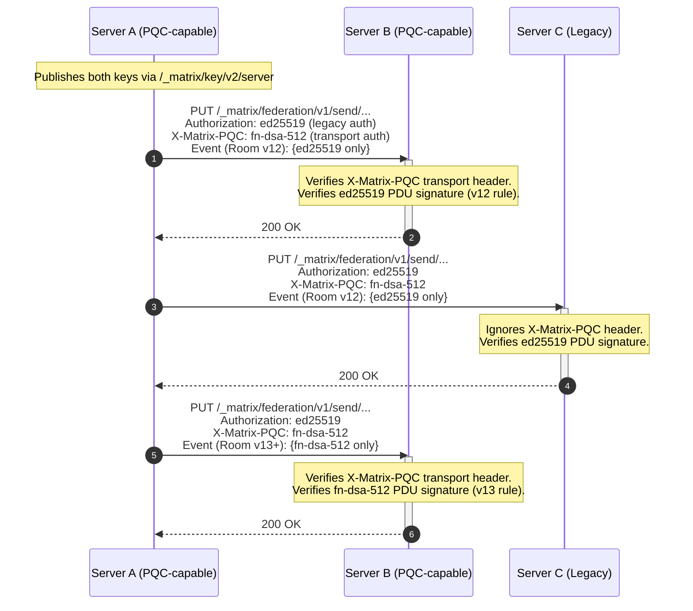

# MSC XXXX: Post-Quantum Digital Signatures for Federation and E2EE

Matrix PDU signing and device E2EE systems currently use `ed25519`. Quantum computers can theoretically reverse engineer private keys via Shor's algorithm, breaking elliptic-curve and RSA schemes.

This MSC aims to prevent the forgery of new room events, spoofing federation requests, and impersonating E2EE devices. This MSC begins the migration to quantum-safe signatures.

## Proposal

This MSC introduces **FN-DSA** (NTRU-Lattice-Based Digital Signature Algorithm), standardized as [NIST FIPS 206](https://csrc.nist.gov/pubs/fips/206/ipd), as the post-quantum signature scheme for Matrix. FN-DSA (Falcon) was selected by NIST for compact signatures and fast verification — both critical for high-throughput federation.

### Algorithm Parameters

This MSC proposes a single, unified signature scheme.

| Parameter Set | NIST Level     | Public Key | Signature  | Verification | Use Case                                   |
| ------------- | -------------- | ---------- | ---------- | ------------ | ------------------------------------------ |
| `fn-dsa-512`  | I (128-bit PQ) | 897 bytes  | ~666 bytes | ~0.1 ms      | Server signing keys, PDUs, and device keys |

Matrix event IDs use SHA-256, which provides 128-bit classical collision resistance. Grover's algorithm reduces SHA-256's preimage resistance to ~128 bits against a quantum adversary. Going beyond NIST Level I for signatures offers no practical benefit since SHA-256 elsewhere in the system is a comparable security bound.

In PQC-required room versions, servers and clients MUST support `fn-dsa-512`.

> **Note:** For readability, this proposal uses the intended stable identifier `fn-dsa-512` throughout the main text and examples. Until this MSC is accepted and merged into the Matrix specification, implementations MUST use the unstable identifier `org.matrix.mscXXXX.fn-dsa-512` in all protocol fields (key IDs, signature entries, and algorithm names). See [Unstable Prefix](#unstable-prefix) for the full mapping.

### Key Identifier Format

Matrix currently identifies keys using the format `algorithm:key_id` (e.g., `ed25519:abc123`). This MSC extends the set of recognized algorithm identifiers:

| Key Algorithm | Description                  | Key ID Format         |
| ------------- | ---------------------------- | --------------------- |
| `ed25519`     | Existing Ed25519 (unchanged) | `ed25519:<key_id>`    |
| `fn-dsa-512`  | FN-DSA at NIST Level I       | `fn-dsa-512:<key_id>` |

Key IDs MUST be unique within each algorithm namespace on a given server.

### Server Signing Keys

The `GET /_matrix/key/v2/server` response includes both key types:

```json
{
  "server_name": "example.com",
  "verify_keys": {
    "ed25519:auto": {
      "key": "<unpadded-base64-ed25519-pubkey>"
    },
    "fn-dsa-512:pqc0": {
      "key": "<unpadded-base64-fn-dsa-512-pubkey>"
    }
  },
  "old_verify_keys": {
    "fn-dsa-512:pqc_retired": {
      "key": "<unpadded-base64-fn-dsa-512-pubkey>",
      "expired_ts": 1798761600000
    }
  },
  "valid_until_ts": 1798848000000
}
```

FN-DSA public keys are encoded as unpadded base64. Servers should begin publishing FN-DSA keys immediately, even before PQC room versions exist, to pre-distribute public keys across the federation.

### PDU Signing

PQC PDU signatures are strictly gated to a new room version. Legacy room versions are unchanged.

#### Legacy Room Versions (v12 and before)

In older room versions, servers continue to sign and verify PDUs using Ed25519 only.

#### PQC-Required Room Versions (v13+)

In room versions that require PQC signatures (see [Room Version Requirements](#room-version-requirements)):

- Origin servers MUST sign all outgoing PDUs with `fn-dsa-512`.
- Legacy `ed25519` signatures are expressly PROHIBITED to avoid payload bloat and downgrade ambiguity.
- Receiving servers MUST reject PDUs that lack a valid `fn-dsa-512` signature.

```json
{
  "signatures": {
    "example.com": {
      "fn-dsa-512:pqc0": "<base64-fn-dsa-512-signature>"
    }
  }
}
```

### Federation HTTP Authentication

Sending servers MUST include the `X-Matrix-PQC` header on all outgoing federation requests, regardless of whether the destination supports PQC. Unknown HTTP headers are safely ignored per RFC 9110, so no capability discovery is needed.

```http
Authorization: X-Matrix origin="example.com",destination="matrix.org",key="ed25519:auto",sig="<base64-ed25519-signature>"
X-Matrix-PQC: origin="example.com",destination="matrix.org",key="fn-dsa-512:pqc0",sig="<base64-fn-dsa-signature>"
```

The FN-DSA signature MUST be computed over the same JSON signing object used for existing Matrix federation request authentication (containing `method`, `uri`, `origin`, `destination`, and `content` when present).

Receiving servers that support this spec MUST verify the `X-Matrix-PQC` header if present. During transition, if verification fails, the server SHOULD log a warning but MUST NOT reject the request if the Ed25519 `Authorization` header is valid. Legacy servers ignore the header entirely.

Because a single federation transaction can carry PDUs for multiple rooms (some legacy, some PQC), HTTP auth cannot be scoped to a room version. The Ed25519 `Authorization` header remains permanent as long as any legacy room exists.

### Event ID and Content Hash Computation

Event IDs (room versions 3+) and content hashes (`hashes.sha256`) are computed **excluding signatures**. Adding FN-DSA signatures therefore changes neither event IDs nor content hashes.

### E2EE Device Key Migration

#### Device Signing Keys

The `/keys/upload` endpoint is extended to accept FN-DSA device signing keys:

```json
{
  "device_keys": {
    "user_id": "@alice:example.com",
    "device_id": "JLAFKJWSCS",
    "algorithms": ["m.olm.v1.curve25519-aes-sha2", "m.megolm.v1.aes-sha2"],
    "keys": {
      "curve25519:JLAFKJWSCS": "<base64-curve25519-key>",
      "ed25519:JLAFKJWSCS": "<base64-ed25519-key>",
      "fn-dsa-512:JLAFKJWSCS": "<base64-fn-dsa-512-key>"
    },
    "signatures": {
      "@alice:example.com": {
        "ed25519:JLAFKJWSCS": "<base64-ed25519-self-signature>",
        "fn-dsa-512:JLAFKJWSCS": "<base64-fn-dsa-512-self-signature>"
      }
    }
  }
}
```

Clients SHOULD upload FN-DSA device keys alongside Ed25519 keys.

#### Cross-Signing Keys

Cross-signing master, self-signing, and user-signing keys should also support FN-DSA:

```json
{
  "master_key": {
    "user_id": "@alice:example.com",
    "usage": ["master"],
    "keys": {
      "ed25519:base64+master+key": "<base64-ed25519-master-key>",
      "fn-dsa-512:base64+pqc+master+key": "<base64-fn-dsa-512-master-key>"
    }
  }
}
```

When cross-signing a device key, the signing client SHOULD produce both an Ed25519 and an FN-DSA signature. Verifying clients that support this MSC MUST verify the FN-DSA cross-signature if present, and SHOULD treat it as the authoritative trust anchor. If an FN-DSA cross-signature is present but fails verification, clients MUST treat that relationship as untrusted and MUST NOT fall back to Ed25519 for the same relationship. Ed25519-only evaluation is permitted only when no FN-DSA cross-signature exists.

**E2EE Downgrade Risk:** A compromised homeserver could strip FN-DSA keys from `/keys/query` responses to force Ed25519 fallback. The Ed25519 fallback above applies only when the FN-DSA signature is absent, not when it is present but invalid. Strict protection against stripping requires client-side key pinning (TOFU) or constrained room membership (MSC3917), both deferred to a follow-up MSC.

#### Key Agreement (Informational)

This MSC does **not** change Olm/Megolm key agreement (Curve25519/X25519). Migration to ML-KEM (FIPS 203) is deferred to a separate MSC.

### Client Implementation Requirements

**Key Generation.** Clients that support this MSC MUST generate FN-DSA keypairs locally for:

- Device signing keys (`fn-dsa-512`) — uploaded via `/keys/upload`
- Cross-signing keys (`fn-dsa-512`) — uploaded via `/keys/device_signing/upload`

Client implementations MUST use a side-channel-resistant FN-DSA library (see [Falcon's implementation complexity](#potential-issues)).

**Signing.** Clients MUST sign their own device keys with both their Ed25519 and FN-DSA device signing keys (self-signatures). When cross-signing another device or user, the signing client SHOULD produce both an Ed25519 and an FN-DSA cross-signature. **All FN-DSA signatures MUST be computed over the exact same Matrix Canonical JSON representation of the object as the legacy Ed25519 signatures** (i.e., after stripping the `signatures` and `unsigned` fields).

**Verification.** Clients MUST verify FN-DSA signatures in the E2EE trust chain:

- Device key self-signatures (when evaluating a device's authenticity)
- Cross-signing signatures (master -> self-signing -> device key chain)

Clients do **not** verify PDU signatures or federation HTTP authentication — these are exclusively homeserver responsibilities.

**What clients do NOT need to do:**

- Verify or inspect the `signatures` object on timeline events (homeserver-only)
- Process `X-Matrix-PQC` headers (server-to-server transport)
- Implement FN-DSA for Olm/Megolm key agreement (deferred to a separate MSC)

### Interaction Sequence



### Migration Timeline

**Phase 1 — Transport, E2EE, & Key Distribution (Immediate)**
Servers begin publishing FN-DSA keys via `/_matrix/key/v2/server` and transmitting the `X-Matrix-PQC` header for Server-to-Server HTTP authentication. Clients begin uploading `fn-dsa-512` device and cross-signing keys. PDUs continue to be signed exclusively with Ed25519 according to legacy room versions.

**Phase 2 — PQC Room Version (Deployment)**
A new room version is formalized which makes `fn-dsa-512` the sole, authoritative PDU signature scheme. Users and administrators may upgrade existing rooms to this version to gain post-quantum PDU signatures. Legacy rooms (v12 and below) remain untouched.

## Room Version Requirements

This MSC requires a **new room version**. All PQC changes are scoped to this version — existing room versions are unaffected.

- **PDU signing:** `fn-dsa-512` signature REQUIRED. Legacy `ed25519` signatures are strictly FORBIDDEN to prevent heterogeneous event formats.
- **Signature verification in auth rules:** Step 5 of the [checks performed on receipt of a PDU](https://spec.matrix.org/v1.14/server-server-api/#checks-performed-on-receipt-of-a-pdu) ("Passes signature checks...") is modified to require strict verification of the FN-DSA signature. If no valid FN-DSA signature is present, the event MUST be rejected.
- **Redaction algorithm:** The `signatures` field behavior is unchanged — redacted events retain all signatures, including FN-DSA signatures.
- **Event format:** No changes to event format. FN-DSA signatures are entries in the existing `signatures` object.

The new room version does **not** change:

- State resolution algorithm (remains v2)
- Event ID computation (reference hash is signature-independent)
- Auth rules (beyond the signature verification step)
- Redaction rules (beyond signature preservation)

## Potential Issues

- **Signature size increase.** FN-DSA-512 signatures are ~666 bytes vs Ed25519's 64 bytes (10×). Even 10 co-signatures only consume ~8.8 KB Base64, well within the 65 KB PDU limit.

- **FIPS 206 not yet finalized.** FIPS 206 is in final stages but unpublished as of May 2026. Unstable prefixes allow parameter updates without breaking stable identifiers. FIPS 203/204/205 were finalized in August 2024; FIPS 206 is expected to follow.

- **Falcon's implementation complexity.** FN-DSA key generation requires constant-time discrete Gaussian sampling — non-constant-time implementations leak secret keys via timing side channels. Implementers MUST use the [reference implementation](https://falcon-sign.info/), `pqcrypto-falcon`, or `liboqs`.

- **Key rotation complexity.** Servers must now manage and rotate two independent key types. However, Matrix already supports key rotation via `old_verify_keys`, and the mechanics are identical for FN-DSA keys.

- **Public key size.** FN-DSA-512 public keys are 897 bytes (vs 32 for Ed25519), adding ~1.2 KB per key to `/_matrix/key/v2/server` responses. Negligible.

## Alternatives

- **ML-DSA (FIPS 204 / Dilithium).** Integer-only arithmetic eliminates FN-DSA's side-channel concerns, but ML-DSA-44 signatures exceed 2.4 KB vs FN-DSA's ~666 bytes. The bandwidth cost is prohibitive for heavily co-signed, federated events.

- **SLH-DSA (FIPS 205 / SPHINCS+).** Most conservative (hash-based, no lattice assumptions), but 17,088-byte signatures are impractical for per-event signing. Potentially useful for long-lived trust anchors in a future MSC.

- **Hybrid Ed25519 + PQC.** NIST SP 800-227 recommends hybrid constructions, but this MSC avoids hybrid PDU signing — in v13+ rooms, FN-DSA is the sole authority. The transport layer (`X-Matrix-PQC` + Ed25519 `Authorization`) is hybrid during transition, but that's HTTP-only.

- **Waiting for FIPS 206 finalization.** Delaying extends the vulnerability window. Unstable prefixes allow early adoption without committing to final identifiers.

- **Extending Olm/Megolm to PQC.** Key agreement migration (Curve25519 → ML-KEM) is orthogonal and far more complex. Bundling would delay everything. Signature migration provides immediate protection against server impersonation; key agreement (the HNDL concern) is addressed separately.

## Performance & Lightweighting Opportunities

PQC means larger keys and signatures. The ~888 bytes Base64 per FN-DSA signature is permanent — signatures cannot be pruned because Event IDs (Room Version 3+) are computed _without_ them, so the DAG commits to content but not authorship. Every event must retain its signature for independent verification.

### Payload Optimization: Binary Encodings (Informational)

Base64-in-JSON inflates payloads by 33% (~220 wasted bytes per FN-DSA signature). The PQC room version is an ideal catalyst to adopt CBOR (MSC2432).

### HTTP Overhead: Symmetric Federation Auth (Informational)

Attaching an ~888-byte `X-Matrix-PQC` header to every request is wasteful. A future MSC should negotiate symmetric session keys via PQC KEM. Protocol sketch:

**Session Establishment.** When server A first contacts server B (or when a session expires), A performs an ML-KEM-768 (FIPS 203) encapsulation against B's published ML-KEM public key (distributed via `/_matrix/key/v2/server` in a future MSC). This produces a shared secret `ss` and a ciphertext `ct`. A sends `ct` to B in an `X-Matrix-KEM-Init` header on the first request. B decapsulates `ct` to recover `ss`.

**Key Derivation.** Both sides derive a symmetric session key using HKDF-SHA-256:

```python
#!/usr/bin/env python3
import hashlib
from cryptography.hazmat.primitives.kdf.hkdf import HKDF
from cryptography.hazmat.primitives import hashes

# Example inputs
origin = "example.com"
destination = "matrix.org"
ct = b'\x00' * 1088   # ML-KEM-768 ciphertext placeholder
ss = b'\x00' * 32     # ML-KEM shared secret placeholder

# Length-prefixed encoding
origin_bytes      = len(origin).to_bytes(2, 'big') + origin.encode()
destination_bytes = len(destination).to_bytes(2, 'big') + destination.encode()

# Salt
salt = hashlib.sha256(origin_bytes + destination_bytes + ct).digest()

# Session key
session_key = HKDF(
    algorithm=hashes.SHA256(),
    length=32,
    salt=salt,
    info=b'matrix-federation-hmac-v1',
).derive(ss)

print("salt:       ", salt.hex())
print("session_key:", session_key.hex())
```

**Per-Request Authentication.** Once a session is established, subsequent requests replace the ~888-byte `X-Matrix-PQC` asymmetric signature with a 32-byte HMAC-SHA-256:

```http
Authorization: X-Matrix origin="example.com",destination="matrix.org",key="ed25519:auto",sig="<base64-ed25519-signature>"
X-Matrix-HMAC: session_id="<session-id>",mac="<base64-hmac-sha-256>"
```

The HMAC is computed over the same canonical JSON signing object used by existing Matrix federation request authentication.

**Session Lifecycle.** Rotate every 24 hours or 10,000 requests. Either side renegotiates via a new `X-Matrix-KEM-Init` header. The old key MUST be retained for 60 seconds to cover in-flight requests.

## Implementation Guidance

FN-DSA libraries:

| Library                                                                                       | Language        | FFI Required                                        | Notes                                                                                                                                                            |
| --------------------------------------------------------------------------------------------- | --------------- | --------------------------------------------------- | ---------------------------------------------------------------------------------------------------------------------------------------------------------------- |
| [liboqs](https://github.com/open-quantum-safe/liboqs)                                         | C               | Yes (FFI bindings for Python, Rust, Go, Java, .NET) | Reference PQC library from the Open Quantum Safe project. Includes Falcon alongside all NIST PQC finalists. Compiles to WASM via Emscripten for browser targets. |
| [oqs-rs](https://github.com/AldanTan);[liboqs-rust](https://github.com/AldanTanneo/liboqs-rs) | Rust (FFI to C) | Yes (wraps liboqs)                                  | Rust bindings for liboqs. Suitable for server-side implementations (e.g., conduwuit, Synapse-via-PyO3).                                                          |
| [pqcrypto-falcon](https://crates.io/crates/pqcrypto-falcon)                                   | Rust            | No (pure Rust)                                      | Part of the `pqcrypto` crate family. No C dependency — simplifies cross-compilation and auditing.                                                                |
| [oqs-provider](https://github.com/open-quantum-safe/oqs-provider)                             | C (OpenSSL 3.x) | N/A                                                 | OpenSSL provider enabling PQC via existing TLS stacks. Useful for federation TLS termination but not directly for Matrix JSON signing.                           |
| [falcon.js](https://github.com/nickthecook/falcon-js) (community)                             | JavaScript      | No                                                  | Community WASM/JS port. Must be audited for constant-time guarantees before production use.                                                                      |

All implementations MUST use constant-time Gaussian sampling. liboqs compiles to WASM for browser clients; mobile clients use platform FFI.

## Security Considerations

- **Real-time impersonation.** Matrix's SHA-256 DAG protects historical event integrity from quantum adversaries. The primary threat is an attacker deriving a server's Ed25519 private key to forge _new_ events and spoof federation traffic in real time. This MSC permanently closes that attack vector.

- **Timing side-channels.** FN-DSA's discrete Gaussian sampler leaks private keys via timing analysis if implemented incorrectly. All implementations MUST use audited, constant-time libraries (see Implementation Guidance).

- **Algorithm agility.** The `algorithm:key_id` format accommodates future PQC standards without further MSCs. If FN-DSA is compromised, the unstable prefix can be deprecated and a replacement introduced.

- **Downgrade attacks (federation).** PDU signatures are bound to room versions — stripping FN-DSA from a PQC room event invalidates it. Stripping the `X-Matrix-PQC` header only downgrades transport auth, not PDU integrity.

- **Downgrade attacks (E2EE).** A compromised homeserver could strip FN-DSA keys from `/keys/query`. This MSC does not solve that; TOFU or MSC3917 are needed. Clients SHOULD warn if a previously-observed FN-DSA key disappears.

- **Key compromise recovery.** Identical to Ed25519: rotate the key, publish the old key in `old_verify_keys` with `expired_ts`. Events signed with the compromised key cannot be retroactively invalidated.

## Unstable Prefix

While this MSC is in development, the following unstable prefixes are used:

| Stable Identifier            | Unstable Identifier                              |
| ---------------------------- | ------------------------------------------------ |
| `fn-dsa-512` (key algorithm) | `org.matrix.mscXXXX.fn-dsa-512`                  |
| `X-Matrix-PQC` (HTTP header) | `X-Matrix-PQC` (no prefix needed, custom header) |

The unstable prefixes are used in `verify_keys` key IDs, `signatures` entries, and `X-Matrix-PQC` header `key` parameters. For example:

```json
{
  "verify_keys": {
    "org.matrix.mscXXXX.fn-dsa-512:pqc0": {
      "key": "<base64-fn-dsa-512-pubkey>"
    }
  }
}
```

Once this MSC is accepted but not yet merged into a released spec version, implementations SHOULD support both the unstable prefix and the stable identifier, accepting either.

## Dependencies

- **NIST FIPS 206 (FN-DSA):** Unstable prefixes buffer against pre-finalization changes.

## Backwards Compatibility

This proposal is fully backwards-compatible:

- **Phase 1 (Key Distribution & Transport)** has zero impact on events or PDU auth rules. Transport auth is additive (`X-Matrix-PQC` is ignored by legacy servers).
- **Phase 2 (PQC Room Versions)** isolates PDU format changes to new room version. Rooms that are not upgraded continue to use Ed25519. This spec gives no advice on backporting to legacy rooms.
- **No new endpoints.** Existing endpoints are extended (new key types in `verify_keys`, new `signatures` entries, new HTTP header).
- **E2EE backwards compatibility.** Cross-signing continues with Ed25519. FN-DSA cross-signatures are optional.

---

## MSC Checklist

- [ ] Are [appropriate implementation(s)](https://spec.matrix.org/proposals/#implementing-a-proposal) specified in the MSC's PR description?
- [ ] Are all MSCs that this MSC depends on already accepted?
- [ ] For each endpoint that is introduced or modified:
  - [ ] Have authentication requirements been specified?
  - [ ] Have rate-limiting requirements been specified?
  - [ ] Have guest access requirements been specified?
  - [ ] Are error responses specified?
    - [ ] Does each error case have a specified `errcode` (i.e. `M_FORBIDDEN`) and HTTP status code?
      - [ ] If a new `errcode` is introduced, is it clear that it is new?
  - [x] Are the [endpoint conventions](https://spec.matrix.org/latest/appendices/#conventions-for-matrix-apis) honoured?
    - [x] Do HTTP endpoints `use_underscores_like_this`?
    - [x] Will the endpoint return unbounded data? If so, has pagination been considered?
    - [ ] If the endpoint utilises pagination, is it consistent with [the appendices](https://spec.matrix.org/latest/appendices/#pagination)?
- [x] Will the MSC require a new room version, and if so, has that been made clear?
  - [x] Is the reason for a new room version clearly stated? For example, modifying the set of redacted fields changes how event IDs are calculated, thus requiring a new room version.
- [x] Are backwards-compatibility concerns appropriately addressed?
- [x] An introduction exists and clearly outlines the problem being solved. Ideally, the first paragraph should be understandable by a non-technical audience.
- [ ] All outstanding threads are resolved
  - [ ] All feedback is incorporated into the proposal text itself, either as a fix or noted as an alternative
- [x] There is a dedicated "Security Considerations" section which detail any possible attacks/vulnerabilities this proposal may introduce, even if this is "None.". See [RFC3552](https://datatracker.ietf.org/doc/html/rfc3552) for things to think about, but in particular pay attention to the [OWASP Top Ten](https://owasp.org/www-project-top-ten/).
- [x] The other section headings in the template are optional, but even if they are omitted, the relevant details should still be considered somewhere in the text of the proposal. Those section headings are:
  - [x] Introduction
  - [x] Proposal text
  - [x] Potential issues
  - [x] Alternatives
  - [x] Unstable prefix
  - [x] Dependencies
- [x] Stable identifiers are used throughout the proposal, except for the unstable prefix section
  - [x] Unstable prefixes [consider](https://github.com/matrix-org/matrix-spec-proposals/blob/main/README.md#unstable-prefixes) the awkward accepted-but-not-merged state
  - [x] Chosen unstable prefixes do not pollute any global namespace (use "org.matrix.mscXXXX", not "org.matrix").
- [ ] Changes have applicable [Sign Off](https://github.com/matrix-org/matrix-spec-proposals/blob/main/CONTRIBUTING.md#sign-off) from all authors/editors/contributors
